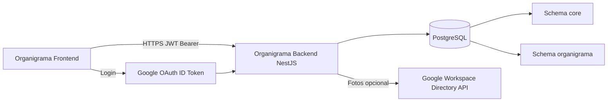
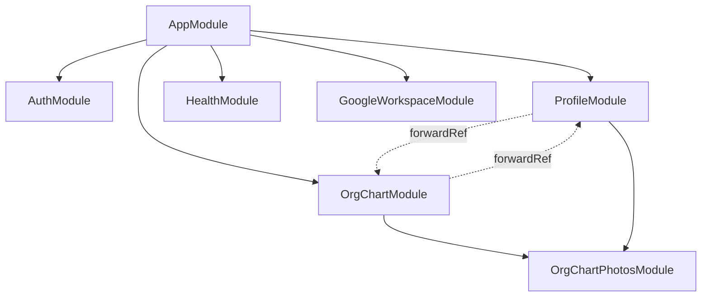
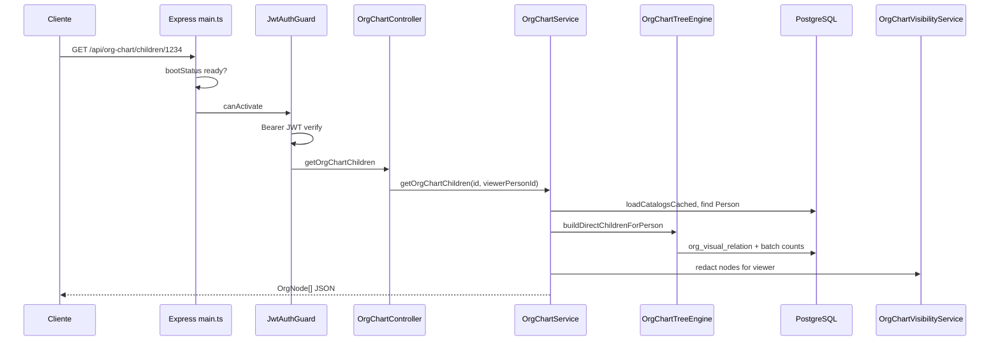
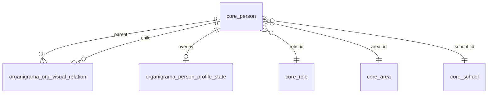

# Organigrama OP Backend

Documentación técnica corporativa del API NestJS que alimenta **Organigrama OP** (visualización del organigrama de la Dirección de Operaciones, CUN).

**Documentación complementaria:**

| Documento | Contenido |
|-----------|-----------|
| [docs/organigrama-core.md](./docs/organigrama-core.md) | Core vs organigrama, motor del árbol, visibilidad, legacy |
| [docs/DEPLOY_PRODUCCION.md](./docs/DEPLOY_PRODUCCION.md) | Checklist Cloud Run, legacy 410, verificación |
| [../docs/FLUJO-USUARIO.md](../docs/FLUJO-USUARIO.md) | Flujo de usuario (técnico, monorepo) |

---

## Resumen ejecutivo

### Qué es este backend

API HTTP construida con **NestJS 11** y **TypeORM**, desplegable en **Google Cloud Run**. Expone autenticación institucional (Google + JWT), onboarding de perfil, lectura progresiva del organigrama organizacional y proxy de fotos.

### Qué problema resuelve

- Centralizar la **lectura** del organigrama visual de Dirección de Operaciones sin duplicar el modelo maestro de personas en otro sistema.
- Aplicar **reglas de visibilidad jerárquica** (quién ve datos sensibles de quién).
- Soportar **carga lazy** del árbol (raíz → hijos directos → expansión) para UIs con mapas grandes.
- Integrar **login Google** `@cun.edu.co` vinculado a colaboradores activos en Core.

### Responsabilidades que SÍ tiene

| Área | Responsabilidad |
|------|-----------------|
| Auth | Verificar ID token de Google; emitir y validar JWT de sesión |
| Perfil | Onboarding editable (documento, teléfono, emergencia) sobre `core.person` + estado en `organigrama.person_profile_state` |
| Organigrama | Construir nodos JSON desde `organigrama.org_visual_relation` + catálogos Core |
| Visibilidad | Redactar PII según descendientes del viewer en el grafo visual |
| Fotos | Resolver y servir imágenes (Google sesión, persistidas, Workspace Directory) |
| Salud | Health checks de app y base de datos |
| Operación | Arranque compatible con Cloud Run (puerto abierto antes de TypeORM) |

### Responsabilidades que NO tiene

- **No es** el sistema maestro de RRHH (eso es **Core** en PostgreSQL).
- **No escribe** relaciones organizacionales en Core (solo lee personas y catálogos).
- **No administra** usuarios locales (usuario/contraseña propio); solo Google institucional.
- **No implementa** RBAC de roles de aplicación (admin/editor); la restricción es jerárquica + reglas de login.
- **No incluye** en este repositorio `cloudbuild.yaml` ni IaC completa de GCP (solo documentación y Dockerfile).

### Relación con el Frontend

`Organigrama_Frontend` (Vite/React) consume este API con prefijo `/api`:

- Login: `POST /api/auth/google`
- Onboarding: `GET|PATCH /api/profile/me`
- Mapa: `GET /api/org-chart/root`, `/node/:id`, `/children/:id`
- Detalle: `GET /api/org-chart/person/:id`, `/summary/:personId`, `/search`
- Fotos en ``: `GET /api/org-chart/photos/:personId?access_token=...`

CORS configurable vía `CORS_ORIGIN` (por defecto `http://localhost:5173`).

### Relación con Core

**Core** (`schema core` en PostgreSQL) es la fuente de verdad de:

- `core.person` — colaboradores, correos, documento, teléfono, emergencia, FKs a catálogos
- `core.role`, `core.area`, `core.school`, `core.program`, `core.hierarchy`, etc.

El backend **lee** Core y **actualiza solo campos de onboarding** acordados en `core.person` (no redefine la estructura laboral).

### Relación con PostgreSQL

- Conexión vía TypeORM (`DB_*`).
- Schemas usados: **`core`** (maestro) y **`organigrama`** (relaciones visuales + estado de perfil OP).
- Producción: `DB_SYNCHRONIZE=false`; migraciones SQL en `migrations/`.
- Cloud Run: socket `/cloudsql/...` recomendado; IP pública + `DB_SSL=true` solo si la red lo permite.

---

## Arquitectura general



| Componente | Rol |
|------------|-----|
| **Frontend** | SPA; guarda JWT; carga progresiva del mapa |
| **Backend** | API REST, auth, reglas de negocio, redacción |
| **PostgreSQL** | Persistencia Core + overlay organigrama |
| **Google Auth** | Identidad del colaborador en login |
| **Google Workspace** | Fotos de directorio (opcional, service account + DWD) |

---

## Arquitectura NestJS

### AppModule

`src/app.module.ts` registra:

- `ConfigModule.forRoot` — solo `.env` (no carga `.env.local` automáticamente)
- `TypeOrmModule.forRootAsync` — entidades y conexión PostgreSQL
- `AuthModule`, `ProfileModule`, `HealthModule`, `OrgChartModule`, `GoogleWorkspaceModule`
- `AppController` — índice `/api`
- `OrganigramaDemoSeedBootstrap` — seed demo opcional al iniciar

### Módulos registrados



### Flujo de una petición HTTP

1. **Express** (`main.ts`): CORS, estáticos `/public`, `GET /api/health/live`, gate **503** si boot ≠ `ready`.
2. **Nest** sobre el mismo `ExpressAdapter`: prefijo global `api`.
3. **JwtAuthGuard** (global en `AuthModule` vía `APP_GUARD`): salvo `@Public()`.
4. **Controller** → método.
5. **Service** → lógica, TypeORM, visibilidad, cachés.
6. **Response** JSON o stream (fotos).

No hay `ValidationPipe` global ni filtros de excepción personalizados: validación en servicios; errores estándar Nest (`UnauthorizedException`, `NotFoundException`, `GoneException`, etc.).

### Inyección de dependencias y ciclo de vida

- Providers `@Injectable()` por módulo.
- `forwardRef` entre `ProfileModule` y `OrgChartModule` por dependencia circular (`ProfileService` ↔ `OrgChartService`).
- Bootstrap: `NestFactory.create` → `app.init()` → `bootStatus = 'ready'`.
- Seed demo: `OnModuleInit` en `OrganigramaDemoSeedBootstrap` si `RUN_DEMO_SEED=true`.

---

## Estructura de carpetas

```
Organigrama_Backend/
├── src/
│   ├── main.ts                 # Bootstrap Express + Nest, CORS, health live
│   ├── app.module.ts           # Raíz de módulos y TypeORM
│   ├── app.controller.ts       # GET /api
│   ├── auth/                   # Google login, JWT, guard global
│   ├── health/                 # /api/health, /api/health/db
│   ├── person/entities/        # Entidad core.person
│   ├── catalogs/entities/      # Entidades core.* catálogos
│   ├── profile/                # Onboarding, PATCH perfil, dev reset
│   ├── org-chart/              # Árbol, búsqueda, resúmenes, visibilidad
│   │   ├── photos/             # Proxy de fotos y providers
│   │   ├── entities/           # org_visual_relation (+ org_relation no registrada)
│   │   └── types/              # DTOs de respuesta JSON
│   ├── google-workspace/       # Service account, diagnóstico fotos
│   └── database/               # Seeds y bootstrap demo
├── migrations/                 # SQL manuales (producción)
├── docs/                       # organigrama-core, DEPLOY_PRODUCCION
├── public/                     # Estáticos (/public/*)
├── Dockerfile                  # Multi-stage Cloud Run
├── docker-compose.yml          # Postgres 16 local
├── .env.example
└── package.json
```

| Carpeta | Responsabilidad |
|---------|-----------------|
| `auth/` | Login Google, JWT, `@Public()`, utilidades de sesión en `Request` |
| `person/` | Mapeo TypeORM de `core.person` |
| `catalogs/entities/` | Tablas maestras Core (rol, área, escuela, …) |
| `profile/` | API de perfil del colaborador autenticado + estado onboarding |
| `org-chart/` | Motor del árbol, controlador REST, vacantes, visibilidad |
| `org-chart/photos/` | Endpoint binario de fotos, caché, resolución multi-provider |
| `google-workspace/` | Auth de service account y diagnóstico Directory |
| `health/` | Liveness de aplicación y ping SQL |
| `database/` | Seeds idempotentes para desarrollo |

---

## Módulos del sistema

### AuthModule

**Ruta:** `src/auth/`

| Aspecto | Detalle |
|---------|---------|
| **Responsabilidad** | Autenticar colaboradores CUN vía Google ID token; sesión JWT |
| **Imports** | `TypeOrmModule.forFeature([Person])`, `JwtModule` |
| **Controladores** | `AuthController` |
| **Providers** | `AuthService`, `GoogleTokenService`, **`JwtAuthGuard` como APP_GUARD** |
| **Exports** | `AuthService`, `JwtModule` |
| **Entidades** | `Person` |
| **Flujos** | `POST /auth/google` → JWT; `GET /auth/me` → usuario actual |

### ProfileModule

**Ruta:** `src/profile/`

| Aspecto | Detalle |
|---------|---------|
| **Responsabilidad** | Perfil “yo” para onboarding; completitud; foto desde Google |
| **Imports** | `OrgChartPhotosModule`, `forwardRef(OrgChartModule)`, entidades Person + catálogos + `PersonProfileState` |
| **Controladores** | `ProfileController`, `ProfileDevController` (dev) |
| **Providers** | `ProfileService`, `ProfileCompletionService`, `ProfileDevGuard` |
| **DTOs** | `UpdateProfileDto` |
| **Flujos** | GET/PATCH `/profile/me`; POST foto Google; reset dev opcional |

### HealthModule

**Ruta:** `src/health/`

| Aspecto | Detalle |
|---------|---------|
| **Responsabilidad** | Salud de API y conectividad DB |
| **Controladores** | `HealthController` — `@Public()` |
| **Endpoints** | `GET /health`, `GET /health/db` |

### OrgChartModule

**Ruta:** `src/org-chart/`

| Aspecto | Detalle |
|---------|---------|
| **Responsabilidad** | Árbol, búsqueda, fichas, resúmenes, redacción por viewer |
| **Imports** | `forwardRef(ProfileModule)`, TypeORM entidades Core + `OrgVisualRelation`, `OrgChartPhotosModule` |
| **Controladores** | `OrgChartController` |
| **Providers** | `OrgChartService`, `OrgChartTreeEngine`, `OrgChartVisibilityService` |
| **Flujos** | `/root`, `/node/:id`, `/children/:id`, `/person/:id`, `/search`, `/summary/*`, legacy |

### OrgChartPhotosModule

**Ruta:** `src/org-chart/photos/`

| Aspecto | Detalle |
|---------|---------|
| **Responsabilidad** | URL pública de foto, caché, stream `GET /org-chart/photos/:personId` |
| **Providers** | `PhotoResolverService`, `PhotoCacheService`, `PhotoUrlBuilder`, providers: persisted Google, session Google, Workspace directory, dev mock |
| **Dependencias** | `GoogleWorkspaceModule` (opcional) |

### GoogleWorkspaceModule

**Ruta:** `src/google-workspace/`

| Aspecto | Detalle |
|---------|---------|
| **Responsabilidad** | Service account + Domain-Wide Delegation para Directory API; diagnóstico |
| **Controladores** | `GoogleWorkspaceDiagnosticController` (`@Public` + guard de feature flag) |
| **CLI** | `npm run diag:google-photo` |

---

## Flujo completo de una petición (ejemplo real)

**Caso:** `GET /api/org-chart/children/1234` con JWT válido.



| Paso | Capa | Acción |
|------|------|--------|
| 1 | Express | CORS; si `/api` y boot ≠ ready → **503** |
| 2 | JwtAuthGuard | Extrae `Authorization: Bearer` o `?access_token=` (solo GET) |
| 3 | Controller | `viewerPersonId` desde `authSession` en `Request` |
| 4 | Service | Carga catálogos (caché 5 min), persona padre, hijos directos |
| 5 | TreeEngine | Relaciones visuales; fallback `visual-map`; `direct_reports_count` en batch |
| 6 | Visibility | `redactOrgNodeTreeForViewer` |
| 7 | Response | Array de `OrgNode` con `children: []` |

**Nota:** No hay capa Repository dedicada; se usa `@InjectRepository` y queries en `*.query.ts`.

---

## API REST — índice de endpoints

Prefijo global Nest: **`/api`**. Por defecto **JWT obligatorio** salvo `@Public()` o rutas Express previas a Nest.

| Método | Endpoint | Auth | Descripción |
|--------|----------|------|-------------|
| GET | `/api` | Público | Índice / mensaje de API |
| GET | `/api/health/live` | Público (Express) | Boot: `starting` \| `ready` \| `failed` |
| GET | `/api/health` | Público | Salud aplicación |
| GET | `/api/health/db` | Público | `SELECT 1` |
| POST | `/api/auth/google` | Público | Login Google → JWT |
| GET | `/api/auth/me` | JWT | Usuario de sesión |
| GET | `/api/profile/me` | JWT | Perfil onboarding |
| PATCH | `/api/profile/me` | JWT | Actualizar perfil |
| POST | `/api/profile/me/photo-from-google` | JWT | Guardar URL foto Google |
| POST | `/api/dev/profile/reset-onboarding` | Público* | Reset dev (*404 si deshabilitado) |
| GET | `/api/org-chart` | JWT | **Legacy** árbol completo (410 si legacy off) |
| GET | `/api/org-chart/search` | JWT | Búsqueda `?q=` |
| GET | `/api/org-chart/person/:id` | JWT | Ficha con visibilidad |
| GET | `/api/org-chart/team/:id` | JWT | **Legacy** subárbol (410 si legacy off) |
| GET | `/api/org-chart/node/:id` | JWT | Nodo + hijos directos |
| GET | `/api/org-chart/children/:id` | JWT | Solo hijos directos |
| GET | `/api/org-chart/root` | JWT | Raíz fija + hijos directos |
| GET | `/api/org-chart/summary/general-areas` | JWT | Agregados por área |
| GET | `/api/org-chart/summary/:personId` | JWT | Resumen jerárquico |
| GET | `/api/org-chart/photos/:personId` | JWT o `?access_token=` | Stream imagen |
| GET | `/api/google-workspace/diagnostic/photo` | Público* | Diagnóstico (*404 si off) |

---

## API REST — detalle por endpoint

### `POST /api/auth/google` (@Public)

**Objetivo:** Intercambiar Google ID token por JWT de sesión.

**Request body:**

```json
{ "idToken": "<credential_from_google_login>" }
```

**Response 200:**

```json
{
  "accessToken": "<jwt>",
  "user": {
    "personId": "1234",
    "fullName": "...",
    "eduEmail": "nombre_apellido@cun.edu.co",
    "pictureUrl": "https://..."
  }
}
```

**Errores:** `401` token inválido; `403` correo no @cun.edu.co o persona no encontrada/inactiva; colaborador sin `edu_email` válido (local con `_`).

**Caso de uso:** Primer paso del login en Frontend.

---

### `GET /api/auth/me`

**Objetivo:** Datos básicos del usuario autenticado desde JWT.

**Headers:** `Authorization: Bearer <jwt>`

**Errores:** `401` sin token o sesión inválida.

---

### `GET /api/profile/me`

**Objetivo:** Perfil para onboarding (campos Core readonly + editables + `profileCompleted`).

**Errores:** `401`, `404` persona no encontrada.

---

### `PATCH /api/profile/me`

**Body (todos opcionales salvo lógica de `markCompleted`):**

```json
{
  "document": "1234567890",
  "phone": "3001234567",
  "email": "personal@ejemplo.com",
  "address": "Calle 1",
  "emergency_contact_name": "María",
  "emergency_contact_phone": "3009876543",
  "emergency_contact_relationship": "Madre",
  "markCompleted": true
}
```

**Errores:** `400` validación de completitud; `401`.

**Caso de uso:** Finalizar onboarding en Frontend.

---

### `POST /api/profile/me/photo-from-google`

**Objetivo:** Persistir URL de foto de la sesión Google en `person_profile_state`.

**Errores:** `400` si no hay `googlePictureUrl` en sesión.

---

### `GET /api/org-chart/root`

**Objetivo:** Carga inicial del mapa — persona raíz **`id=1144`** (constante `ORG_CHART_ROOT_PERSON_ID`) + **hijos directos** con `children: []` y `direct_reports_count`.

**Response:** Un objeto `OrgNode` (raíz) con array `children` superficial.

**Caché:** Respuesta en memoria ~60 s (`orgChartRootCache`).

**Errores:** `404` si la raíz no existe o no está activa; `401`.

---

### `GET /api/org-chart/node/:id`

**Objetivo:** Exploración de equipo — misma forma que root pero con `:id` como raíz del lienzo.

**Caché:** Por `id`, TTL ~60 s.

---

### `GET /api/org-chart/children/:id`

**Objetivo:** Expansión lazy en el mapa — **solo array de hijos directos**.

**Optimización:** Conteo de nietos vía `countActiveDirectChildrenByParentIds` (una query agrupada).

---

### `GET /api/org-chart/person/:id`

**Objetivo:** Ficha de persona.

**Response clave:**

```json
{
  "id": "...",
  "name": "...",
  "institutionalEmail": "...",
  "photoUrl": "/api/org-chart/photos/...",
  "canViewFullProfile": true,
  "profile": { }
}
```

Si `canViewFullProfile: false`, `profile` es `null` (solo datos públicos mínimos).

---

### `GET /api/org-chart/search?q=`

**Objetivo:** Búsqueda por nombre/documento (mín. 2 caracteres, máx. 20 resultados).

**Query:** `q` obligatorio en práctica.

**Visibilidad:** Hits redactados fuera de rama del viewer.

---

### `GET /api/org-chart/summary/:personId`

**Objetivo:** Métricas jerárquicas (totales bajo el nodo, desglose por hijos directos) sin devolver árbol completo.

---

### `GET /api/org-chart/summary/general-areas`

**Objetivo:** Agregados por áreas de los hijos directos de la raíz.

---

### `GET /api/org-chart/photos/:personId`

**Objetivo:** Devolver bytes de imagen (`Content-Type` imagen, headers de caché, `X-Photo-Source`).

**Auth:** Bearer o `?access_token=` en GET (para etiquetas ``).

**Errores:** `404` sin foto; `401` sin auth.

---

### `GET /api/org-chart` y `GET /api/org-chart/team/:id` (LEGACY)

**Objetivo histórico:** Árbol recursivo completo.

**Producción:** Con `ORG_CHART_LEGACY_ENABLED=false` → **410 Gone** con mensaje de reemplazo.

**Desarrollo:** Si variable ausente → legacy **habilitado** (comportamiento por defecto del código).

---

### Endpoints de diagnóstico y desarrollo

| Endpoint | Condición | Efecto si deshabilitado |
|----------|-----------|-------------------------|
| `POST /api/dev/profile/reset-onboarding` | `PROFILE_DEV_RESET_ENABLED=true`, no producción, email en allowlist | **404** |
| `GET /api/google-workspace/diagnostic/photo?edu_email=` | `GOOGLE_WORKSPACE_PHOTO_DIAG_ENABLED=true` | **404** |

---

## Dominio del organigrama

| Concepto | Significado | Entidad / tabla |
|----------|-------------|-----------------|
| **Persona** | Colaborador activo en la institución | `core.person` |
| **Relación visual** | Arista padre → hijo en el organigrama OP (no reemplaza Core) | `organigrama.org_visual_relation` |
| **Jerarquía (Core)** | Nivel/clasificación en catálogo (`hierarchy.level`) | `core.hierarchy` — **no define** el árbol visual |
| **Jerarquía visual** | Cadena en `org_visual_relation` + reglas de visibilidad | CTE recursivo en `OrgChartVisibilityService` |
| **Rol** | Cargo nominal (COORDINADOR, docente, …) | `core.role` |
| **Área** | División organizacional | `core.area` |
| **Escuela** | Sede / unidad escolar | `core.school` |
| **Programa** | Programa académico vinculado a escuela | `core.program` |
| **Región** | Región geográfica | `core.region` |
| **Ciudad** | Ciudad | `core.city` |
| **Campus** | Campus (FK a ciudad) | `core.campus` |
| **Vacante** | Persona placeholder sin datos reales | Detección en `org-chart-vacancy.ts` (`nodeKind: vacancy`) |

---

## Modelo de datos — entidades TypeORM

> Las entidades **no usan** `@ManyToOne`; las FK son columnas escalares y los joins se hacen en servicios/queries.

### `Person` → `core.person`

| Campo | Tipo | Notas |
|-------|------|-------|
| `id` | bigint PK | Generado |
| `full_name` | varchar | Nombre en API como `name` |
| `document` | varchar | Obligatorio |
| `edu_email`, `email` | varchar | Institucional vs personal |
| `phone`, `address` | varchar | Editables en onboarding |
| `emergency_contact_*` | varchar | Contacto emergencia |
| `role_id`, `area_id`, `school_id`, `program_id`, `hierarchy_id`, `city_id`, `campus_id`, `region_id`, `contract_type_id` | bigint/int FK | Referencias a catálogos |
| `is_active` | boolean | Solo activos en árbol |

### `OrgVisualRelation` → `organigrama.org_visual_relation`

| Campo | Notas |
|-------|-------|
| `parent_person_id`, `child_person_id` | Unique compuesto |
| `relation_type` | Default `DIRECT_REPORT` |
| `visual_level` | Opcional |
| `is_active` | Filtra relaciones inactivas |

### `PersonProfileState` → `organigrama.person_profile_state`

| Campo | Notas |
|-------|-------|
| `person_id` | PK, FK → `core.person` |
| `profile_completed_at` | Onboarding completado |
| `profile_photo_source`, `profile_photo_url` | Metadatos de foto OP |

### Catálogos Core (`schema core`)

Entidades en `src/catalogs/entities/`: `Role`, `Hierarchy`, `Area`, `School`, `Program`, `City`, `Campus`, `ContractType`, `Region` — tablas homónimas con `id`, `name`, `is_active` (donde aplica).

### Entidad no registrada

`OrgRelation` (`org-chart/entities/org-relation.entity.ts`) — **no** está en `AppModule` TypeORM; no se usa en runtime. La relación activa es `org_visual_relation`.



---

## Esquema de base de datos

### Schema `core`

Tablas maestras institucionales. El backend **lee** ampliamente y **escribe** solo campos de perfil acordados en `person`.

### Schema `organigrama`

| Tabla | Uso |
|-------|-----|
| `org_visual_relation` | Grafo del organigrama OP |
| `person_profile_state` | Onboarding y foto overlay |

### Migraciones (`migrations/`)

| Archivo | Propósito |
|---------|-----------|
| `001_person_profile_state.sql` | Crea `person_profile_state` |
| `002_*.sql` | **Deprecada** — emergencia en profile state |
| `003_core_person_emergency_contact.sql` | Columnas emergencia en `core.person` |

### Tablas ignoradas por el motor visual

- `core.hierarchy.level` no define padre/hijo en el mapa.
- `org_relation` (entidad legacy en código) no está cableada.

---

## Estrategia de construcción del árbol

### Raíz (`GET /root`)

Constante **`ORG_CHART_ROOT_PERSON_ID = '1144'`** en `org-chart.service.ts`. Debe existir `core.person` activo con ese id. No se descubre por rol en el endpoint moderno (el legacy `/org-chart` sí usaba reglas por director).

### Obtención de hijos

**Prioridad 1:** `findActiveVisualRelationsByParentId` → hijos en `org_visual_relation`.

**Prioridad 2 (fallback):** `org-chart.visual-map.ts` — aristas por **nombre de rol** del padre (ej. rol padre → rol hijo, con filtros `match` y `eduEmails`).

### Construcción lazy vs recursiva

| Modo | Método motor | Uso |
|------|--------------|-----|
| **Lazy (recomendado)** | `buildDirectChildrenForPerson` | `/root`, `/node/:id`, `/children/:id` — hijos con `children: []` |
| **Recursivo (legacy)** | `buildChildrenForPerson` | `/org-chart`, `/team/:id` — árbol anidado completo |

### `direct_reports_count`

`OrgChartTreeEngine.countActiveDirectChildrenByParentIds`: una query SQL agrupada `COUNT(*)` por `parent_person_id` para todos los padres del nivel actual — evita N consultas de conteo.

### Evitar N+1

| Técnica | Ubicación |
|---------|-----------|
| Caché de catálogos 5 min | `loadCatalogsCached()` — 9 `find()` en paralelo |
| Batch carga personas por ids | `In(...)` preservando orden de relaciones |
| Batch conteos hijos | `countActiveDirectChildrenByParentIds` |
| Prefetch IDs foto Google | `withGooglePhotoContext` — un query por árbol |
| Caché respuesta root/node 60 s | `orgChartRootCache`, `orgChartNodeCache` |
| Caché descendientes visibilidad 5 min | `OrgChartVisibilityService` |

### Fase del organigrama

`isPersonIncludedInCurrentOrgPhase`: roles con nivel resuelto desde nombre ≤ 5 (mapa en `visual-map`). Excluye personas fuera de fase del JSON.

### Logs de rendimiento

`ORG_CHART_PERF_LOGS=true` — tiempos de construcción en logs.

---

## Seguridad

### JWT

- Firmado con `AUTH_JWT_SECRET`, expiración `AUTH_JWT_EXPIRES_IN` (default `7d`).
- Payload: `personId`, `googleSubject`, `googleEmail`, `googlePictureUrl`.
- Guard global: `JwtAuthGuard` excepto `@Public()`.

### Google Auth (login)

- `GoogleTokenService.verifyIdToken` — `google-auth-library`.
- `GOOGLE_CLIENT_ID` debe coincidir con el cliente OAuth del Frontend.
- Email normalizado a `@cun.edu.co`; match de persona por `edu_email` (`.` → `_` en parte local).

### Guards adicionales

| Guard | Uso |
|-------|-----|
| `ProfileDevGuard` | Reset onboarding dev |
| `GoogleWorkspaceDiagnosticGuard` | Diagnóstico fotos |

### Decorador `@Public()`

Metadata `IS_PUBLIC_KEY` — bypass JWT.

### Cómo llega una petición autenticada

1. Cliente envía `Authorization: Bearer <jwt>`.
2. `JwtAuthGuard` verifica y adjunta sesión en `Request`.
3. Controlador usa `getAuthSessionFromRequest(req).personId` como **viewer**.
4. Servicios aplican visibilidad según viewer.

### Roles de aplicación

**No hay** roles admin/user en JWT. La restricción de datos es **jerárquica** (self + descendientes en grafo visual).

---

## Variables de entorno

| Variable | Obligatoria | Descripción | Ejemplo |
|----------|-------------|-------------|---------|
| `DB_HOST` | Sí | Host o socket Cloud SQL | `localhost` / `/cloudsql/proyecto:region:instancia` |
| `DB_PORT` | No | Puerto PostgreSQL | `5432` |
| `DB_USERNAME` | Sí | Usuario BD | `postgres` |
| `DB_PASSWORD` | Sí | Contraseña | `***` |
| `DB_NAME` | Sí | Base de datos | `core` |
| `DB_SCHEMA` | No | search_path opcional | — |
| `DB_SSL` | No | SSL hacia IP pública | `true` / `false` |
| `DB_SYNCHRONIZE` | No | Sync entidades (solo dev) | `false` en prod |
| `DB_LOGGING` | No | SQL log TypeORM | `false` |
| `NODE_ENV` | Recomendada | `production` en Cloud Run | `production` |
| `CORS_ORIGIN` | Recomendada | Orígenes CSV | `https://frontend.run.app` |
| `PORT` | No | Puerto HTTP (Cloud Run inyecta 8080) | `8080` |
| `ORG_CHART_LEGACY_ENABLED` | **Sí en prod** | `false` bloquea legacy 410 | `false` |
| `ORG_CHART_PHOTOS_ENABLED` | No | Proxy fotos | `true` |
| `API_PUBLIC_BASE_URL` | Si fotos | URL pública del API | `https://api.run.app` |
| `ORG_CHART_PHOTO_CACHE_TTL_MS` | No | TTL caché foto positiva | `86400000` |
| `ORG_CHART_PHOTO_NEGATIVE_CACHE_TTL_MS` | No | TTL caché miss | `3600000` |
| `ORG_CHART_PHOTO_FETCH_CONCURRENCY` | No | Concurrencia fetch | `5` |
| `ORG_CHART_PHOTO_TEST_URL` | No | URL prueba raíz | — |
| `GOOGLE_WORKSPACE_PHOTOS_ENABLED` | No | Fotos Directory API | `false` |
| `GOOGLE_CLIENT_ID` | Sí (auth) | OAuth Web client | `xxx.apps.googleusercontent.com` |
| `AUTH_JWT_SECRET` | Sí (auth) | Secreto JWT ≥32 chars | `***` |
| `AUTH_JWT_EXPIRES_IN` | No | Expiración JWT | `7d` |
| `PROFILE_DEV_RESET_ENABLED` | No | Reset onboarding dev | `true` |
| `PROFILE_DEV_RESET_ALLOWED_EMAILS` | No | CSV emails permitidos | `user@cun.edu.co` |
| `GOOGLE_WORKSPACE_PHOTO_DIAG_ENABLED` | No | Diagnóstico foto | `false` |
| `GOOGLE_WORKSPACE_PHOTO_DIAG_ALLOW_IN_PRODUCTION` | No | Diag en prod | `false` |
| `GOOGLE_SERVICE_ACCOUNT_JSON` | Condicional | JSON inline SA | `{"type":"service_account",...}` |
| `GOOGLE_SERVICE_ACCOUNT_KEY_PATH` | Condicional | Ruta archivo SA | `./secrets/...json` |
| `GOOGLE_WORKSPACE_ADMIN_EMAIL` | Condicional | Admin DWD | `admin@cun.edu.co` |
| `RUN_DEMO_SEED` | No | Seed al boot | `true` |
| `ORG_CHART_PERF_LOGS` | No | Logs perf organigrama | `true` |

> No commitear `.env` con secretos reales. Usar Secret Manager en Cloud Run.

---

## Configuración local

### Requisitos

- Node.js **LTS** (22 en Dockerfile)
- npm
- PostgreSQL **16+** (local: `docker compose up -d` en este directorio)
- Cuenta Google OAuth (mismo `GOOGLE_CLIENT_ID` que Frontend)
- (Opcional) Google Cloud SDK para probar despliegues
- (Opcional) Docker para imagen de producción

### Instalación

```bash
cd Organigrama_Backend
cp .env.example .env
# Editar DB_* y GOOGLE_CLIENT_ID, AUTH_JWT_SECRET
npm install
```

### Base de datos

1. Crear BD y schemas `core` + `organigrama` (según entorno institucional).
2. Ejecutar migraciones en `migrations/`.
3. Poblar Core (datos reales o `npm run seed` / `RUN_DEMO_SEED=true` para demo vacía).

---

## Ejecución local

```bash
npm run start:dev
```

API en `http://localhost:3000` — prefijo `/api`.

**Health temprano:** `GET http://localhost:3000/api/health/live` durante arranque.

---

## Scripts disponibles (`package.json`)

| Script | Descripción |
|--------|-------------|
| `npm run build` | `nest build` → `dist/` |
| `npm run start` | `node dist/main.js` |
| `npm run start:dev` | Nest watch (desarrollo) |
| `npm run start:debug` | Watch + inspector |
| `npm run start:prod` | Producción local compilada |
| `npm run lint` | ESLint + fix |
| `npm run format` | Prettier en `src/` y `test/` |
| `npm run test` | Jest unitarios |
| `npm run test:watch` | Jest watch |
| `npm run test:cov` | Cobertura |
| `npm run test:e2e` | E2E (`test/jest-e2e.json`) |
| `npm run seed` | Build + seed demo idempotente |
| `npm run diag:google-photo` | Diagnóstico CLI Workspace |
| `npm run diag:org-photo` | Diagnóstico CLI fotos nodo organigrama |

---

## Docker

### Dockerfile (multi-stage)

| Stage | Acción |
|-------|--------|
| **builder** | `node:22-alpine`, `npm ci`, copia `src`, `npm run build`, `npm prune --omit=dev` |
| **runner** | Usuario `node`, copia `dist` + `node_modules` prod, `CMD node dist/main.js`, `EXPOSE 8080` |

**Build local:**

```bash
docker build -t organigrama-backend .
docker run --rm -p 8080:8080 --env-file .env -e PORT=8080 organigrama-backend
```

### docker-compose.yml

Servicio `postgres:16-alpine`, puerto 5432, BD `organigrama`, usuario/contraseña `postgres`. Volumen `organigrama_pgdata`.

> En integración real con Core institucional, `DB_NAME` suele ser `core`, no solo el contenedor demo.

---

## Cloud Run

**No hay `cloudbuild.yaml` en el repositorio.** Despliegue documentado manualmente en `docs/DEPLOY_PRODUCCION.md` y `docs/organigrama-core.md`.

### Checklist producción

| Tema | Recomendación |
|------|----------------|
| **Conexión BD** | `--add-cloudsql-instances` + `DB_HOST=/cloudsql/...` + `DB_SSL=false` |
| **Puerto** | Cloud Run inyecta `PORT=8080`; `main.ts` escucha `0.0.0.0` |
| **Legacy** | `ORG_CHART_LEGACY_ENABLED=false` obligatorio |
| **Sync** | `DB_SYNCHRONIZE=false` |
| **Health** | Usar `/api/health/live` para startup; `/api/health` cuando `ready` |
| **CORS** | `CORS_ORIGIN` = URL del frontend desplegado |
| **Secretos** | `AUTH_JWT_SECRET`, `DB_PASSWORD`, SA JSON vía Secret Manager |

### Verificación post-deploy

```bash
gcloud run services describe NOMBRE_SERVICIO --region=REGION \
  --format="yaml(spec.template.spec.containers[0].env)"
```

Ver [docs/DEPLOY_PRODUCCION.md](./docs/DEPLOY_PRODUCCION.md) para curls de legacy **410**.

---

## Observabilidad

| Mecanismo | Detalle |
|-----------|---------|
| **Logs Nest** | `logger: ['error', 'warn', 'log']` en bootstrap |
| **TypeORM** | `DB_LOGGING=true` para SQL |
| **Legacy warnings** | `OrgChartController` loguea llamadas deprecated |
| **Perf organigrama** | `ORG_CHART_PERF_LOGS=true` |
| **Boot** | `/api/health/live` expone `status`, `uptimeMs`, `dbHost`, `error` |
| **Diagnóstico Google** | Endpoint y scripts `diag:*` |

No hay integración APM/OpenTelemetry en el código actual.

---

## Rendimiento

Resumen de optimizaciones **reales en código**:

- Caché catálogos (5 min).
- Caché respuestas root/node (60 s).
- Caché descendientes visibilidad (5 min por viewer).
- Batch counts hijos directos.
- Caché fotos positiva/negativa (TTL configurable).
- Conexión TypeORM: menos reintentos y timeout en producción.
- Carga lazy evita serializar árbol completo.

---

## Manejo de errores

| Tipo | HTTP típico | Origen |
|------|-------------|--------|
| Sin JWT | 401 | `JwtAuthGuard`, `UnauthorizedException` |
| Correo no institucional | 403 | `AuthService` |
| Persona no encontrada | 404 | `NotFoundException` en org-chart/profile |
| Legacy deshabilitado | 410 | `GoneException` |
| API en arranque | 503 | Middleware Express en `/api` |
| Boot fallido | Proceso exit 1 | `main.ts` catch |

No hay filtro global que transforme excepciones a un formato corporativo unificado.

---

## Guía para nuevo desarrollador

### 1. Levantar el proyecto

```bash
npm install
cp .env.example .env
docker compose up -d   # opcional Postgres local
# Aplicar migrations/*.sql
npm run start:dev
```

### 2. Conectar la BD

Ajustar `DB_*` al instance que tenga schemas `core` y `organigrama`. Verificar con `GET /api/health/db`.

### 3. Probar endpoints

```bash
# Login (obtener idToken desde Frontend o Google OAuth playground)
curl -X POST http://localhost:3000/api/auth/google \
  -H "Content-Type: application/json" \
  -d '{"idToken":"..."}'

export TOKEN="<accessToken>"
curl -H "Authorization: Bearer $TOKEN" http://localhost:3000/api/org-chart/root
```

### 4. Agregar un endpoint

1. Método en `*Controller` bajo prefijo del módulo.
2. Lógica en `*Service`.
3. Si es público: `@Public()` en el handler.
4. Documentar en este README y en Frontend si aplica.

### 5. Agregar una entidad

1. Crear `*.entity.ts` con `schema` correcto.
2. Registrar en `TypeOrmModule.forFeature` del módulo y en `entities: []` de `app.module.ts` si es global.
3. Preferir migración SQL en producción (`DB_SYNCHRONIZE=false`).

### 6. Agregar un módulo

1. `nest g module nombre` o carpeta manual.
2. Importar en `AppModule`.
3. Exportar servicios que otros módulos necesiten.

### 7. Desplegar

Build imagen → push Artifact Registry → `gcloud run deploy` con variables de [Cloud Run](#cloud-run) y revisión de [DEPLOY_PRODUCCION.md](./docs/DEPLOY_PRODUCCION.md).

---

## Troubleshooting

| Problema | Causa probable | Solución |
|----------|----------------|----------|
| `503 API iniciando` | TypeORM aún conectando | Esperar; revisar `/api/health/live` |
| `failed` en health/live | PostgreSQL inalcanzable | `DB_HOST`, firewall, Cloud SQL attachment |
| `401 Inicia sesión` | Sin Bearer o JWT expirado | Renovar login |
| `403` en login | Email no CUN o no colaborador | Verificar `edu_email` en Core |
| `404` raíz organigrama | Falta persona `1144` activa | Corregir datos Core o constante |
| `410` en `/org-chart` | Legacy off (correcto en prod) | Usar `/root`, `/node`, `/children` |
| CORS bloqueado | Origen no listado | Añadir URL a `CORS_ORIGIN` |
| Fotos rotas | `API_PUBLIC_BASE_URL` incorrecta | Alinear con URL pública del API |
| SSL error Cloud SQL | `DB_SSL=true` con socket | Socket → `DB_SSL=false` |

---

## Roadmap técnico (inferido del código)

| Ítem | Estado |
|------|--------|
| Endpoints legacy `GET /org-chart`, `/team/:id` | Deprecados; bloqueo 410 en prod |
| Entidad `OrgRelation` | Sin registrar en TypeORM |
| `employees.seed.ts` | Wrapper deprecado → demo seed |
| Migración `002_*` | Deprecada |
| README anterior (`employees`, sin auth) | **Reemplazado por este documento** |
| `ValidationPipe` / DTO class-validator | No implementado |
| `cloudbuild.yaml` | Ausente en repo |
| Tests e2e | Existen; requieren BD configurada |

No se encontraron comentarios `TODO`/`FIXME` en `src/`.

---

## Pendiente por confirmar

Información **no inferible** solo desde el repositorio:

| Tema | Qué falta |
|------|-----------|
| **Proyecto GCP exacto** | ID proyecto, región Cloud Run, nombre servicio |
| **Instancia Cloud SQL** | Connection name real en producción |
| **Pipeline CI/CD** | Si existe fuera del repo (Build triggers, GitHub Actions) |
| **Secretos producción** | Valores en Secret Manager (solo nombres, no valores) |
| **URL frontend producción** | Para `CORS_ORIGIN` definitivo |
| **Política de rotación JWT** | Operativa institucional |
| **Criterio de cambio de `ORG_CHART_ROOT_PERSON_ID`** | Proceso de negocio |

---

## Resumen de documentación generada

Este README consolida:

- Arquitectura y módulos NestJS reales
- 18+ rutas HTTP documentadas
- 12 entidades TypeORM activas + 1 no registrada
- Motor de árbol, lazy loading, visibilidad y optimizaciones
- Auth Google + JWT + guards
- Variables de entorno (incl. no listadas en `.env.example`)
- Docker, Cloud Run, scripts, migraciones, troubleshooting y onboarding dev

**Información conservada** del README anterior: comandos npm, flujo recomendado `/root` + `/children`, referencia a legacy y `ORG_CHART_LEGACY_ENABLED`, CORS local — actualizados al estado actual del código.

---

## Apéndice A — Toolchain y configuración TypeScript

| Archivo | Propósito |
|---------|-----------|
| `package.json` | Dependencias Nest 11, TypeORM 0.3, JWT, `google-auth-library`, `googleapis` |
| `nest-cli.json` | `sourceRoot: src`, `deleteOutDir: true` en build |
| `tsconfig.json` | `module: nodenext`, `target: ES2023`, decoradores experimentales, `strictNullChecks` |
| `tsconfig.build.json` | Excluye tests del build de producción |

**Nota:** `noImplicitAny: false` en `tsconfig.json` — el proyecto permite `any` implícito en zonas legacy; conviene tipar código nuevo.

No existe `ormconfig.ts` separado: toda la configuración TypeORM vive en `AppModule` (`TypeOrmModule.forRootAsync`).

---

## Apéndice B — Contrato JSON `OrgNode` (Frontend)

Campos principales devueltos por `/root`, `/node/:id`, `/children/:id` (ver `types/org-node.type.ts`):

| Campo | Descripción |
|-------|-------------|
| `id` | ID persona en Core (string) |
| `name` | `full_name` |
| `document` | Puede redactarse según viewer |
| `role`, `hierarchy`, `area`, `school`, `program` | Objetos anidados desde catálogos |
| `children` | En lazy: siempre `[]` en hijos devueltos por `/children`; en root/node solo un nivel |
| `direct_reports_count` | Número de hijos directos activos (para UI “+N” sin expandir) |
| `nodeKind` | `person` \| `vacancy` |
| `photoUrl` | URL absoluta o ruta al proxy `/api/org-chart/photos/:id` |
| `orgLevel` | Nivel derivado del nombre de rol (`visual-map`) |
| `location` | Región, ciudad, campus |

El Frontend fusiona respuestas de `/children/:id` en su árbol local (`mergeChildrenIntoTree`).

---

## Apéndice C — Cadena de resolución de fotos

Cuando `ORG_CHART_PHOTOS_ENABLED=true`, `PhotoResolverService` consulta providers en orden (simplificado):

1. **Persisted Google** — URL guardada en `person_profile_state` tras onboarding.
2. **Session Google** — `googlePictureUrl` del JWT (solo durante sesión, no persistido).
3. **Google Workspace Directory** — si `GOOGLE_WORKSPACE_PHOTOS_ENABLED` y DWD configurado.
4. **Dev mock** — entornos de desarrollo con URL de prueba.

`PhotoCacheService` aplica TTL positivo/negativo. `GET /org-chart/photos/:personId` devuelve bytes con `Cache-Control` y header `X-Photo-Source` para diagnóstico.

Si las fotos están deshabilitadas, `PhotoUrlBuilder` puede generar URL legacy directa a Google (solo desarrollo).

---

## Apéndice D — Completitud de perfil (`ProfileCompletionService`)

`profileCompleted` es `true` cuando:

- `document` y `phone` en `core.person` son válidos.
- Contacto de emergencia completo en `core.person` (tres campos).
- `profile_completed_at` en `person_profile_state` (al marcar `markCompleted: true`).

El Frontend usa `GET /profile/me` → `profileCompleted` para guardas de ruta (`RequireProfileComplete`).

---

## Apéndice E — Mapa visual de fallback (`org-chart.visual-map.ts`)

Cuando **no** hay filas en `org_visual_relation` para un padre, el motor usa aristas declarativas por **nombre de rol** del padre:

- Define qué roles hijos buscar en Core (`childRoleName`).
- Opcionalmente filtra por `match` o lista `childEduEmails`.
- Orden de aristas importa: primera coincidencia gana en la iteración.

Este mecanismo permitió bootstrapping del árbol antes de poblar `org_visual_relation`. En producción institucional, la tabla visual debe ser la fuente prioritaria.

---

## Apéndice F — Vacantes (`org-chart-vacancy.ts`)

Personas con nombres/roles de placeholder (lista normalizada `VACANCY_ROLE_NAMES_NORMALIZED`) se marcan como `nodeKind: vacancy`. SQL `VACANCY_PERSON_SQL_WHERE` excluye o incluye según contexto de conteos. La UI puede mostrar glifo de vacante (`OrgMapVacancyGlyph` en Frontend).

---

## Apéndice G — Tests

| Tipo | Ubicación | Comando |
|------|-----------|---------|
| Unitarios | `*.spec.ts` junto a servicios (auth-email, visibility, vacancy, profile-completion) | `npm run test` |
| E2E | `test/` + `jest-e2e.json` | `npm run test:e2e` |

Los e2e requieren PostgreSQL accesible con la misma configuración `.env`. No sustituyen pruebas de contrato con Frontend (Playwright en monorepo).

---

## Apéndice H — Endpoints adicionales (detalle)

### `GET /api/health`

```json
{ "ok": true, "app": "Organigrama Backend", "status": "running" }
```

Público. No valida JWT. Útil para uptime simple.

### `GET /api/health/db`

Público. Ejecuta `SELECT 1`. Falla con **503** si la BD no responde.

### `GET /api/health/live` (Express)

```json
{
  "ok": true,
  "status": "ready",
  "uptimeMs": 12345,
  "dbHost": "localhost",
  "hint": null,
  "error": null
}
```

Durante arranque: `status: "starting"`, `ok: false`. Tras fallo fatal de bootstrap: proceso termina; en algunos despliegues el contenedor reinicia.

### `GET /api`

Índice de API (`AppController`) — mensaje de bienvenida y rutas sugeridas.

### `POST /api/dev/profile/reset-onboarding`

Body: `{ "edu_email": "colaborador@cun.edu.co" }`.

Requiere `PROFILE_DEV_RESET_ENABLED=true`, `NODE_ENV !== production`, email en `PROFILE_DEV_RESET_ALLOWED_EMAILS`. Borra/resetea estado de onboarding para pruebas.

### `GET /api/google-workspace/diagnostic/photo?edu_email=`

Respuesta según `PhotoDiagnosticResult` — prueba lectura de foto en Directory API. No usar en producción salvo flag explícito de allow-in-production.

---

## Apéndice I — Integración institucional con Core

Flujo de datos recomendado:

1. **Core** mantiene altas/bajas, cambios de rol y correos institucionales.
2. **Equipo Organigrama** mantiene `organigrama.org_visual_relation` (quién cuelga de quién en el mapa OP).
3. **Backend** nunca inventa personas: solo lee `is_active=true` salvo endpoints de seed demo.
4. Cambios en `ORG_CHART_ROOT_PERSON_ID` requieren coordinación con Frontend (carga inicial `/root`) y datos Core.

Correo de login: Google debe coincidir con `edu_email` normalizado (local con guión bajo). Colaboradores sin `_` en la parte local del `edu_email` son rechazados (`isCollaboratorEduEmail`).

---

## Apéndice J — Matriz de autenticación por endpoint

| Clase | Endpoints |
|-------|-----------|
| **Público real** | `/api`, `/health`, `/health/db`, `/health/live`, `/auth/google`, estáticos `/public/*` |
| **Público + guard de feature** | `/dev/profile/reset-onboarding`, `/google-workspace/diagnostic/photo` (404 si off) |
| **JWT obligatorio** | Todo lo demás bajo `/api` cuando `bootStatus=ready` |
| **JWT en query (solo GET)** | Fotos (`access_token`) para etiquetas HTML |

---

## Apéndice K — Comandos Cloud Run (referencia operativa)

Despliegue típico (valores ficticios):

```bash
gcloud run deploy organigrama-backend \
  --image=gcr.io/PROYECTO/organigrama-backend:TAG \
  --region=us-central1 \
  --platform=managed \
  --allow-unauthenticated \
  --add-cloudsql-instances=PROYECTO:us-central1:INSTANCIA \
  --set-env-vars="NODE_ENV=production,DB_HOST=/cloudsql/PROYECTO:us-central1:INSTANCIA,DB_SSL=false,DB_SYNCHRONIZE=false,ORG_CHART_LEGACY_ENABLED=false,CORS_ORIGIN=https://frontend.example.com" \
  --set-secrets="DB_PASSWORD=db-password:latest,AUTH_JWT_SECRET=jwt-secret:latest"
```

Escalamiento, CPU y concurrencia dependen de la configuración del servicio en GCP (no versionada en este repo).

---

## Apéndice M — Referencia de catálogos Core (entidades)

Todas en `schema: 'core'`. IDs son `bigint` salvo `region` y `campus` (`integer` en algunos campos de persona).

### `core.role` — `Role`

| Campo | Tipo | Uso en organigrama |
|-------|------|-------------------|
| `id` | bigint PK | `person.role_id` → nombre de cargo en nodo |
| `name` | varchar(150) | Clave para `visual-map` y nivel org |
| `description` | varchar(500) nullable | Detalle en JSON |
| `is_active` | boolean | Filtrado institucional |

### `core.hierarchy` — `Hierarchy`

| Campo | Tipo | Nota |
|-------|------|------|
| `id` | bigint PK | `person.hierarchy_id` |
| `name` | varchar | Etiqueta |
| `description` | text | Opcional |
| `level` | smallint | **No** sustituye `org_visual_relation` |

### `core.area` — `Area`

| Campo | Tipo |
|-------|------|
| `id` | bigint PK |
| `name` | varchar |
| `is_active` | boolean |

Usado en nodos, resúmenes por área (`/summary/general-areas`) y búsqueda.

### `core.school` — `School`

Sede o unidad escolar asociada a la persona (`person.school_id`).

### `core.program` — `Program`

| Campo | Extra |
|-------|-------|
| `school_id` | FK lógica a escuela del programa |
| `name`, `is_active` | Estándar |

### `core.city` — `City`

Ciudad de referencia (`person.city_id`).

### `core.campus` — `Campus`

| Campo | Tipo |
|-------|------|
| `city_id` | integer nullable |
| `name`, `is_active` | Ubicación en `OrgNode.location` |

### `core.region` — `Region`

Región geográfica (`person.region_id`).

### `core.contract_type` — `ContractType`

Tipo de contrato laboral (`person.contract_type_id`); visible en perfil completo.

---

## Apéndice N — Algoritmo de emparejamiento Google ↔ Core

Implementado en `auth.service.ts` + `auth-email.util.ts`:

1. Recibir email del token Google (ej. `jose.camacho@cun.edu.co` o gmail institucional normalizado).
2. `normalizeInstitutionalEmail` fuerza dominio `@cun.edu.co`.
3. Extraer parte local y reemplazar `.` por `_` → `jose_camacho`.
4. Buscar persona activa cuyo `edu_email` contenga esa local part (query institucional).
5. Validar `isCollaboratorEduEmail`: la parte local del `edu_email` en Core debe contener `_` (convención de colaboradores).
6. Si falla cualquier paso → `403 Forbidden` o `401 Unauthorized` con mensaje en español.

Este diseño evita cuentas estudiantiles o correos sin convención de colaborador.

---

## Apéndice O — Servicios principales y métodos (mapa de código)

### `OrgChartService` (selección)

| Método | Endpoint / uso |
|--------|----------------|
| `getOrgChartRoot` | `GET /root` |
| `getOrgChartNode` | `GET /node/:id` |
| `getOrgChartChildren` | `GET /children/:id` |
| `getPersonDetail` | `GET /person/:id` |
| `searchOrgChart` | `GET /search` |
| `getNodeSummary` | `GET /summary/:personId` |
| `getGeneralAreasSummary` | `GET /summary/general-areas` |
| `getOrgChartTree` | Legacy `GET /` |
| `getOrgChartSubtree` | Legacy `GET /team/:id` |
| `loadCatalogsCached` | Interno — caché 5 min |
| `applyTreeVisibility` | Redacción recursiva de nodos |

### `OrgChartTreeEngine`

| Método | Modo |
|--------|------|
| `buildChildrenForPerson` | Recursivo (legacy) |
| `buildDirectChildrenForPerson` | Lazy (producción) |
| `countActiveDirectChildrenByParentIds` | Batch SQL |

### `OrgChartVisibilityService`

| Método | Descripción |
|--------|-------------|
| `canViewFullProfile` | Booleano self ∪ descendientes |
| `getVisibleDescendantIds` | CTE recursivo + caché 5 min |

### `ProfileService`

| Método | Endpoint |
|--------|----------|
| `getProfileMe` | `GET /profile/me` |
| `updateProfileMe` | `PATCH /profile/me` |
| `savePhotoFromGoogle` | `POST /profile/me/photo-from-google` |

---

## Apéndice P — Política de caché y consistencia

| Caché | TTL | Invalidación |
|-------|-----|--------------|
| Catálogos | 5 min | Expiración temporal |
| Root/node respuesta | 60 s | Expiración temporal |
| Descendientes visibilidad | 5 min | Por viewer |
| Fotos positivas/negativas | Env configurable | TTL ms |

**Importante:** Tras cambios en `org_visual_relation` o bajas de personas, los clientes pueden ver datos hasta 60 s en root/node; operaciones críticas pueden requerir invalidación futura (no implementada hoy).

---

## Apéndice Q — Comparativa endpoints legacy vs progresivos

| Necesidad UI | ❌ Legacy | ✅ Progresivo |
|--------------|----------|---------------|
| Primera pantalla | `GET /org-chart` (árbol enorme) | `GET /org-chart/root` |
| Explorar equipo | `GET /org-chart/team/:id` (subárbol enorme) | `GET /org-chart/node/:id` |
| Expandir nodo | (ya venía en JSON anidado) | `GET /org-chart/children/:id` |
| Payload | O(n) árbol completo | O(hijos directos) por request |
| Producción | 410 con flag off | Soportado |

---

## Apéndice L — Glosario rápido

| Término | Definición |
|---------|------------|
| **OP** | Dirección de Operaciones |
| **Core** | Schema maestro PostgreSQL institucional |
| **Viewer** | Persona autenticada (`personId` del JWT) |
| **Lazy load** | Cargar hijos solo al expandir nodo |
| **Legacy** | Endpoints de árbol completo recursivo |
| **DWD** | Domain-Wide Delegation (Google Workspace) |
| **Redacción** | Ocultar PII en JSON para viewers sin permiso |

---

*Organigrama OP Backend — CUN, Dirección de Operaciones.*
